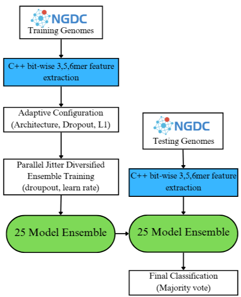

# K-BLEND

K-BLEND is a hybrid genomic classification framework that pairs a fast, alignment-free k-mer neural ensemble with BLAST as a benchmark for classifying SARS-CoV-2 genomes by strain. A dependency-free C++ feature extractor computes bit-wise 3/5/6-mer frequency features directly from FASTA sequences, which feed a diversified ensemble of 25 neural network classifiers trained in parallel and combined via majority vote. The pipeline was evaluated against traditional BLAST alignment on 11,000 genomes spanning 11 SARS-CoV-2 strains (Alpha, Beta, Delta, Epsilon, Eta, Gamma, Iota, Lambda, Mu, Omicron, Zeta), sourced from [NGDC](https://ngdc.cncb.ac.cn/).



This repo contains the full training/evaluation pipeline ([ensemble.sh](ensemble.sh)), the BLAST benchmark harness ([blastTesting.py](blastTesting.py)), and the dataset splits and results tables used in the paper.

## Publication
Published in the proceedings of the 2025 IEEE MIT Undergraduate Research Technology Conference (URTC):
[https://doi.org/10.1109/URTC68753.2025.11533085](https://doi.org/10.1109/URTC68753.2025.11533085)

### Citation
L. Agarwal, J. Koothur and J. Wang, "The K-BLEND Framework: A Hybrid Genomic Workflow Integrating Blast with a Kmer-Based Neural Ensemble," 2025 IEEE MIT Undergraduate Research Technology Conference (URTC), Cambridge, MA, USA, 2025, pp. 1-5, doi: 10.1109/URTC68753.2025.11533085.

```bibtex
@INPROCEEDINGS{11533085,
  author={Agarwal, Laksh and Koothur, Juan and Wang, Juexin},
  booktitle={2025 IEEE MIT Undergraduate Research Technology Conference (URTC)},
  title={The K-BLEND Framework: A Hybrid Genomic Workflow Integrating Blast with a Kmer-Based Neural Ensemble},
  year={2025},
  volume={},
  number={},
  pages={1-5},
  keywords={Modeling;Engines;Genomics;Printing;Tools;Surveillance;Timing;Sequences;Sequential analysis;Machine learning;Hybrid Genomic System;Machine Learning;BLAST;Alignment-Free;K-mer;SARS-CoV-2;Bioinformatics;Diagnostic Workflow;Computational Genomics},
  doi={10.1109/URTC68753.2025.11533085}}
```

## Setup

Use requires linux terminal or ubuntu WSL.
WSL setup directions
1. Open command prompt run
```bash
wsl --install
```
2. Download ubuntu for WSL https://ubuntu.com/desktop/wsl
3. Open WSL

Virtual Environment setup  
```bash
git clone https://github.com/Lotion-3/K-BLEND
```
```bash
cd K-BLEND
```
```bash
sudo apt update
```
```bash
sudo apt install python3-venv
```
```bash
python3 -m venv Ensembleenv
```
```bash
source Ensembleenv/bin/activate
```
```bash
pip install -r req.txt
```

## Data Information  
All genomes compressed using 7z   
Extraction setup:  
```bash
sudo apt update
```
```bash
sudo apt install p7zip-full
```
This experiment utilized 11000 SARS-CoV-2 genomes from 11 strains. Alpha, Beta, Delta, Epsilon, Eta, Gamma, Iota, Lambda, Mu, Omicron, Zeta  
Sourced from NGDC: https://ngdc.cncb.ac.cn/  
Full data set is available in rawFastas folder  
combine_fasta.py file combined all 11000 into comb11000.fasta and generated key.fasta.     

The data set was used to create the 13 splits described in the paper which were generated by using split.py   
Available in fullPaperFastas folder. Warning extracts to 20GB data set.  
```bash
7z x fullPaperFastas.7z
```

Rest of tutorial uses sampleFastas data set containing only 2 splits.  
Available in sampleFastas folder. Extracts to 635MB.  
```bash
7z x sampleFastas.7z
```

The complete tables used in the paper are available in fullPaperTables along with code used to generate figures.  

## Ensemble Usage  
Pre usage setup  
1. Bash Permissions  
```bash
chmod +x ensemble.sh
```
2. C++ Setup
```bash
sudo apt update
```
```bash
sudo apt install build-essential gdb
```
3. Jq setup
```bash
sudo apt-get install jq
```
4. Ramdisk setup
This example uses 8G of commited RAM, adjust to device specifications   
```bash
sudo mkdir -p /mnt/ramdisk
```
```bash
sudo mount -t tmpfs -o size=8G tmpfs /mnt/ramdisk
```
```bash
sudo chown $USER:$USER /mnt/ramdisk
```
```bash
echo always | sudo tee /sys/kernel/mm/transparent_hugepage/enabled
```
Run the ensemble.sh file, this automated script trains 25 ensemble models and provides evaluation data.  
Execution arguments:  
```bash
./ensemble.sh inputDirectory #cpuCores
```
The input directory expects two subdirectories, trainingFastas and testingFastas    
The script recognizes 2 naming systems for train test pairs  
1. Train: train%Train_11000_version# Test: test%test_11000_version#  
Ex. Train: train90_11000_5 Test: test10_11000_5  
Version numbers must match and percentages must add to 100  
2. Train: train_#sequences_version# Test: test_#sequences_version#   
Ex. Train: train_110_1 Test: test_10890_1  
Number of sequences must add to 11000 and version numbers must match  

The #cpuCores decides how many system cpuCores are dedicated to the execution.   
Train+Test pairs are processed one at a time. The 25 models are distributed amongst dedicated cores. One model per core.   
Default is half of system cores. Recommended maximum is the number of system cores -1.  

Usage with sampleFastas:  
```bash
./ensemble.sh sampleFastas 2
```
Evaluation information is saved in the PIPELINE_RESULTS_HPC.csv file.  
Models are saved in saved_models/ directory.  

When finished clean ramdisk
```bash
sudo umount /mnt/ramdisk
```
```bash
sudo rm -r /mnt/ramdisk
```

## BLAST Benchmark usage
Download NCBI BLAST 2.16.0+ tool from: 
https://ftp.ncbi.nlm.nih.gov/blast/executables/blast+/LATEST/  
Place in K-BLEND directory  
Execution arguments:
```bash
python3 blastTesting.py inputDirectory
```
The input directory expects two subdirectories, trainingFastas and testingFastas    
The script recognizes 2 naming systems for train test pairs  
1. Train: train%Train_11000_version# Test: test%test_11000_version#  
Ex. Train: train90_11000_5 Test: test10_11000_5  
Version numbers must match and percentages must add to 100  
2. Train: train_#sequences_version# Test: test_#sequences_version#   
Ex. Train: train_110_1 Test: test_10890_1  
Number of sequences must add to 11000 and version numbers must match

Usage with sampleFastas:
```bash  
python3 blastTesting.py sampleFastas
```

Evaluation information is saved in blast_performance_metrics.csv  
Raw results in blastOutput folder  

## License
This project is licensed under the [MIT License](LICENSE).

